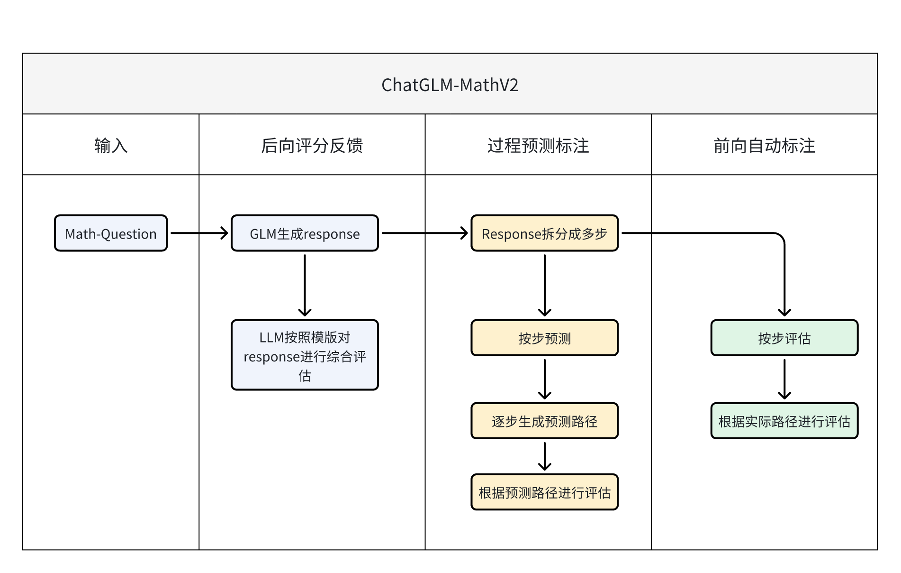

# ChatGLM-MathV2：前向自动标注与后向评分反馈结合进行计算过程奖励

大模型在求解数学问题时，给出的回答通常存在各种计算或推理错误。

为了进一步提升大模型求解数学问题的准确性和鲁棒性，本项目通过详尽的pipeline设计，完成了针对大模型数学能力提升用数据集的自动化制备流程。

具体包括三个部分：分别是模型后向评分反馈、模型过程预测标注 和 模型前向自动标注。

详细pipeline见下图：



## 1. 项目配置

1. 本项目对python环境无严格的版本要求，采用常用的环境即可

2. 进行必要包安装

   ```
   pip install -r requirements.txt
   ```

## 2. 使用说明

### 2.1 最简单的使用方式：调用api

不需要考虑其他事情，只需要简单地运行：

```shell
python api_both.py
```

#### 2.1.1 需要关注的文件

| 文件名称    | 文件说明                                  | 进一步说明 |
| ----------- | ----------------------------------------- | ---------- |
| api_both.py | 这是核心文件，可模仿main函数完成api的调用 | 见下       |
| config.py   | 记录了LLM的API密钥和基本URL               |            |
| chatglm.py  | chatglm调用文件                           |            |

注意需要设置相应的环境变量：共有两个部分。

1. 最开头这两行用于命令行测试，一般不需要打开，如果需要查看api执行过程的详细信息，则打开这两行

   ```python
   import hunter # 用于调试
   hunter.trace(module=__name__) # 用于调试
   ```

2. 设置调用LLM的相关信息。请根据具体情况进行调整，注意llm_response函数名和传入参数、返回值不可更改，否则影响api.py运行

   ```python
   # 该部分用于设置调用的LLM相关信息
   import config # 记录了密钥等实际值
   import openai
   # 设定API密钥和基本URL
   openai.api_key = config.GPT_API_KEY
   openai.api_base = config.GPT_BASE_URL
   from chatglm import ChatGLM
   ChatGLM = ChatGLM()
   USE_GLM_OR_GPT = 'glm'
   # 这里设置使用的llm进行生成，注意在本项目中只有这里一个地方进行相关设置
   def llm_response(prompt, use_glm_or_gpt = USE_GLM_OR_GPT):
       response = "ERROR for LLM"
       for i in range(10):
           if use_glm_or_gpt == 'glm':
               try:
                   response = ChatGLM.generate(prompt)
                   return response
               except:
                   continue
           else:
               try:
                   # 构造messages
                   messages = [{"role": "user", "content": prompt}]
                   # 调用GPT接口
                   # model = "gpt-3.5-turbo"
                   model = "gpt-4-1106-preview"
                   chat_completion = openai.ChatCompletion.create(model=model, messages = messages)
                   response = chat_completion.choices[0].message.content
                   return response
               except:
                   continue
       return response
   ```

在api_both.py的核心函数api中，有一部分可以自适应打开关闭：【可选】

```
def api_both(question, response = None, answer = None):
    ……

    # 如果全量输出，则关闭下面一行，否则只输出必要信息【可选】
    # out_data = postprocess(data4)

    # 如果有到导出文件的必要，可打开下面一行【可选】
    out_to_file(out_data)

    # 返回处理后的数据
    return out_data
```

#### 2.1.2 字段说明

##### 传入字段

```json
{
    "question":"问题", # 一个英文字符串
    "response":"针对问题LLM的响应", # 一个英文字符串（可选）
    "answer":"针对问题的参考答案" # 一个英文字符串（可选）
}
```

##### 主要传出字段

以json格式输出，其中：

1. `questions`：包含具体问题的文本。这通常是用户提出的一个具体的查询或任务，这里以数学问题为主。

2. `response`：对问题LLM的详细回答。这个回答包含了解决问题的步骤、计算和推理过程。

3. `answer`：问题的参考答案。在这个上下文中，可能是空的，表示没有单独的参考答案提供。

4. `critic_result`：这是一个数组，包含对响应的评价和分析。

   - `response`：重复问题的回答。

   - `rating`：给回答的评分，通常是一个数字。

   - `judge_result`：评价回答的文本，详细说明了为何给出该评分。

5. `generated_paths`：这是一个数组，展示了生成答案的不同可能的路径或方法。

   - `step`：描述生成步骤的文本。

   - `extension`：该步骤的不同扩展路径实现方式或详细解释。

   - `ratings`：对每个扩展给出的评分。

   - `soft_label`：软标签，通常用于表示分类的不确定性。

   - `hard_label`：硬标签，通常是一个确定的分类标签。

6. `critic_scores`：总结了批评结果的评分。

   - `ratings`：所有评分的列表。

   - `avg_score`：平均评分。

   - `pass_rate`：通过率，表示有多少比例的评分是积极的。

7. `solution`：这是一个对象，详细描述了解决问题的每个步骤。

   - `Step 1`，`Step 2`等：每个步骤的详细信息，包括内容描述、是否涉及计算或推理、相关的数学方程等。

   - `content`：步骤的描述。

   - `label`：步骤的分类标签。

   - `is_calculation_or_reasoning`：表示步骤是否涉及计算或推理。

   - `equation`：步骤中使用的数学方程。

   - `leftSideOfEqualSign`和`rightSideOfEqualSign`：方程等号左边和右边的计算过程。

   - `history_json`：记录了到达当前步骤的历史路径。
   - 其他更细粒度的标签，参照 [ChatGLM-MathV2：AutomatedLabeling自动化逐步标注人类反馈](./README2.md)

这些键合起来构成了一个结构化的方式来描述和评估一个问题的解决方案及其有效性。

### 2.2 模块化使用

如果针对当前提供的三个模块（模型后向评分反馈、模型过程预测标注 和 模型前向自动标注）希望单独使用或者独立组合使用，请关注这一部分。

我们首先对本项目涉及到的三个模块进行细粒度说明：


针对 模型后向评分反馈、模型过程预测标注，请跳转至  [math-feedback数学反馈](./shepherd_prm/readme.md)

针对 模型前向自动标注，请跳转至  [ChatGLM-MathV2：AutomatedLabeling自动化逐步标注人类反馈](./README2.md)

####  2.2.1 需要关注的文件

| 文件名称     | 文件说明                                            | 进一步说明                                                   |
| ------------ | --------------------------------------------------- | ------------------------------------------------------------ |
| api_front.py | 这是模型后向评分反馈、模型过程预测标注模块的api实现 | [math-feedback数学反馈](./shepherd_prm/readme.md)            |
| api.py       | 这是模型前向自动标注模块的api实现                   | [ChatGLM-MathV2：AutomatedLabeling自动化逐步标注人类反馈](./README2.md) |

### 2.3 可debug的一般使用方式：结合本地文件系统调用api

如果希望对中间过程进行输出，并进行全面跟踪，推荐这种方式

```shell
python pipeline_function_both.py
```

#### 2.2.1 需要关注的文件

| 文件名称                  | 文件说明                                                     |
| ------------------------- | ------------------------------------------------------------ |
| pipeline_function_both.py | 这是包含三个模块pipeline的核心文件，main函数中可选择采用api还是pipeline的形式 |
| pipeline_function.py      | 这是只包含前向自动标注pipeline的核心文件，main函数中可选择采用api还是pipeline的形式 |

## 引用

请根据您使用和引用的内容考虑引用以下内容：

- 代码： alpaca_eval（本软件仓库）。

以下是 bibtex 条目：

```
@misc{du2024chatglmmathv2,
  author = {Jinhua Du and Zhenyu Hou},
  title = {ChatGLM-MathV2: Forward automatic labeling combined with backward scoring feedback for computational process rewarding},
  year = {2024},
  publisher = {GitHub},
  journal = {GitHub repository},
  howpublished = {\url{https://github.com/dujh22/ChatGLM-MathV2}}
}
```
